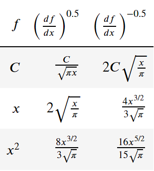
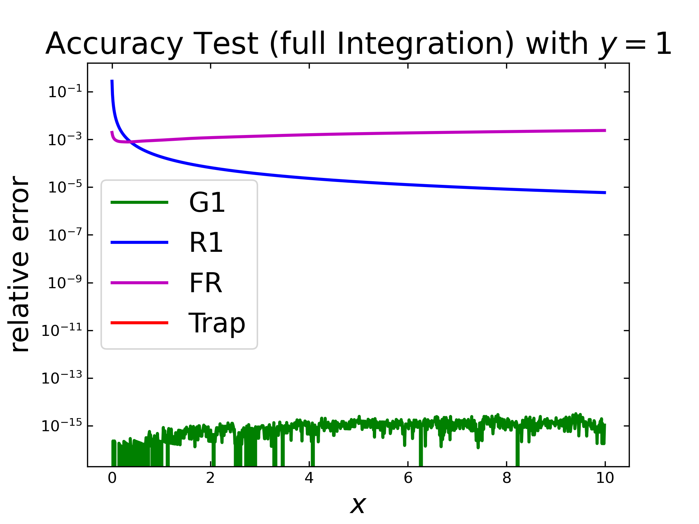
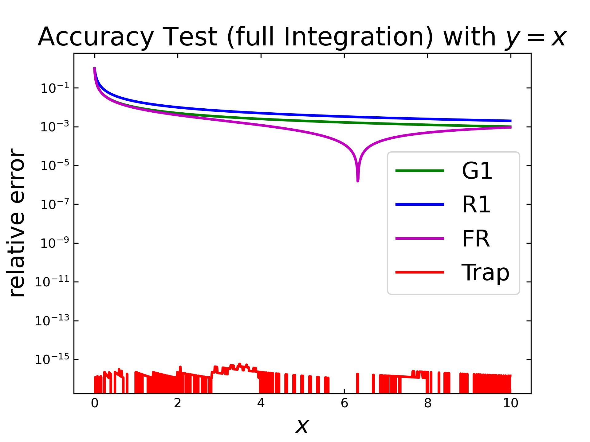
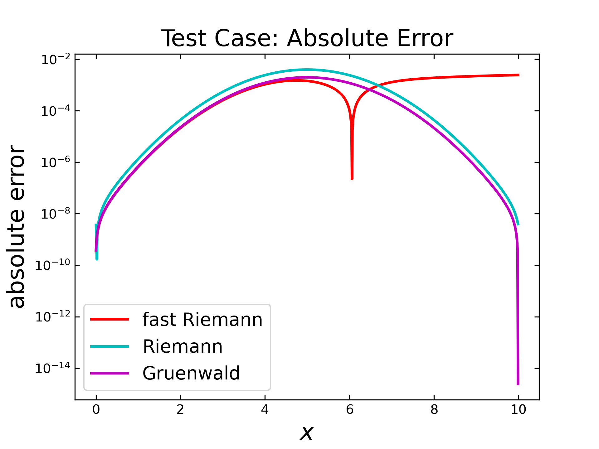
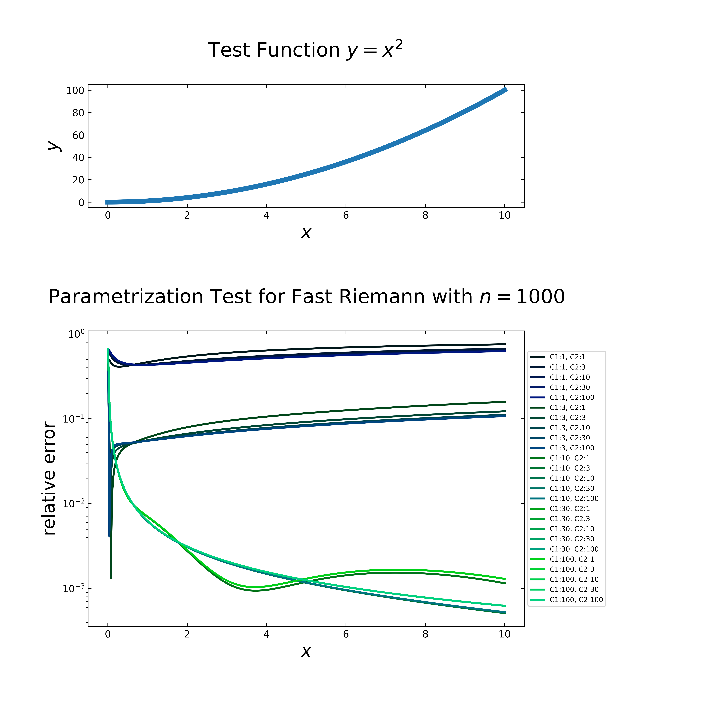
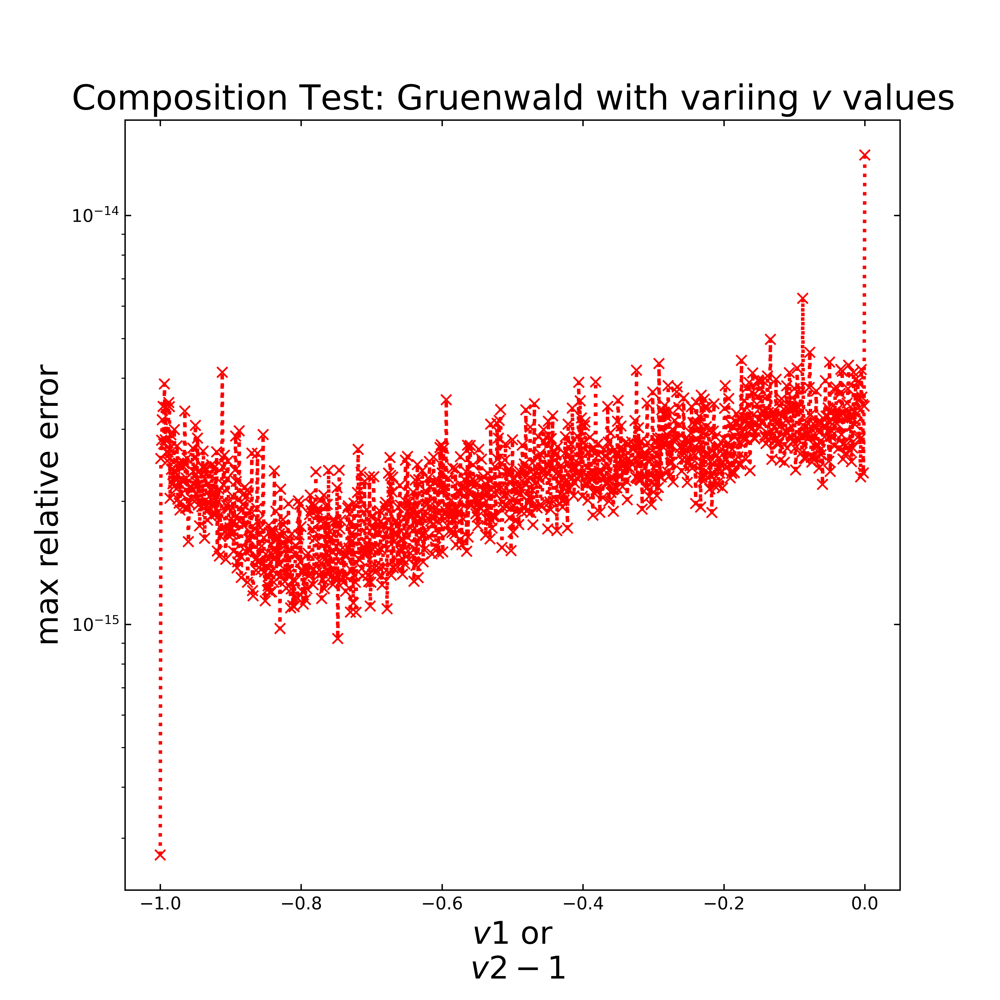
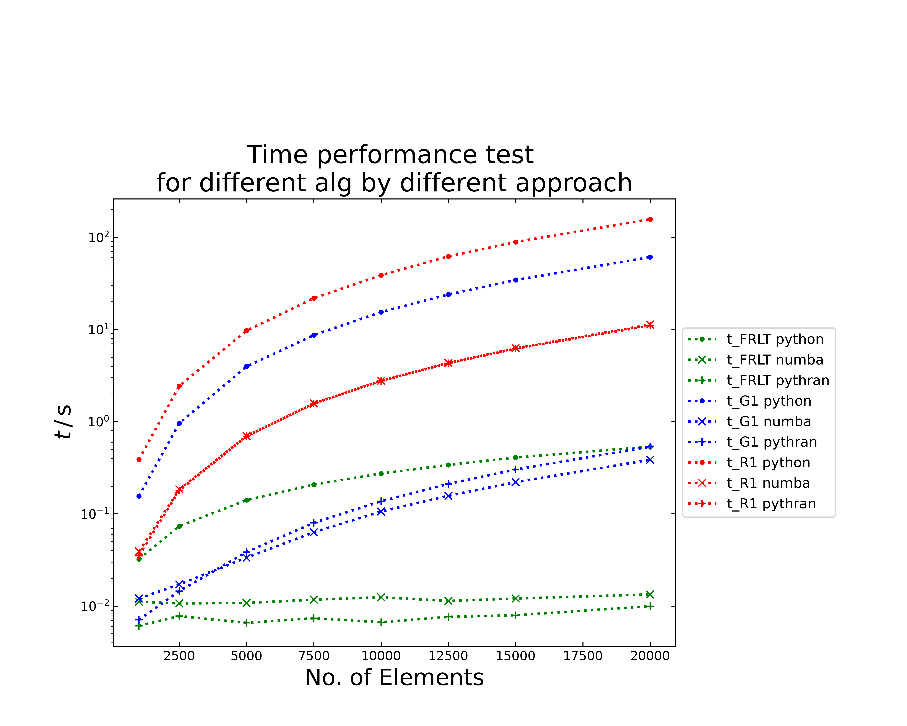
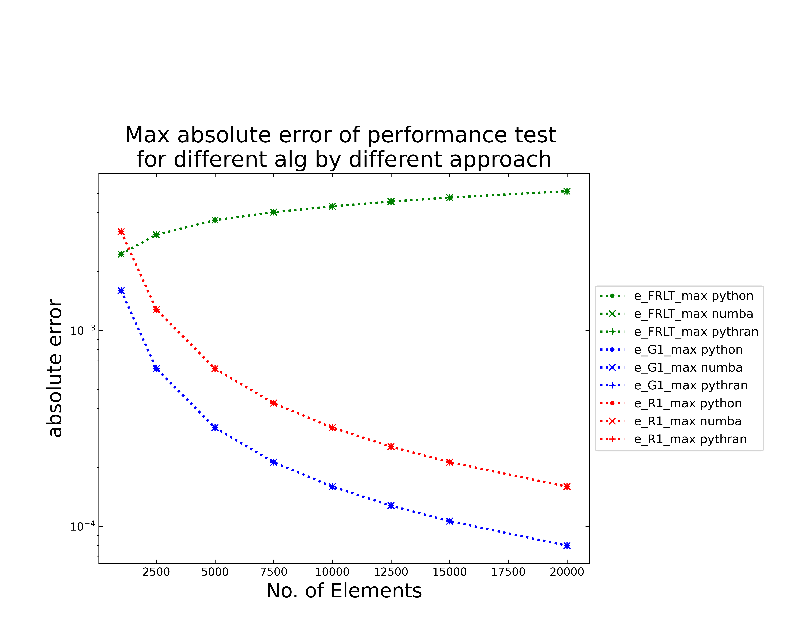

Semi Integration and Differentiation
====================

The main part of the ec-tools package are the implemented numerical semi integration (or differentiation) algorithms. The following section describes the underlying principles and algorithms, based on literature of Oldham  {cite:p}`oldham_fractional_2006,oldham_electrochemical_2013` and Pajkossy {cite:p}`pajkossy_fast_1984_65`. The second section provides information about how to work with the algorithms. In the third section, the different algorithms are tested for accuracy, functionality and (time) performance.

Fundamentals
------------------------------------

```{eval-rst}
.. automodule:: ec_tools.semi_integration
```

Call Algorithms
------------------------------------
```{eval-rst}
.. automodule:: ec_tools.semi_integration.semi_integration
   :members:
```
The generalized ``semi_integration`` function can be imported and executed by:  

```python
from ec_tools.semi_integration import semi_integration
semi_integration(y, t, alg, transonic_backend)
```

The implemented algorithms can be selected by the ``alg`` flag (see above) or 
the algorithms can be imported and executed individually for more control (see below).
Since the semi-integration can be more or less computationally intensive the possibility to speed up the computation by relying on the `transonic` library is included.


```{eval-rst}
.. automodule:: ec_tools.semi_integration.gruenwald 
   :members:
```

Import the Gruenwald function directly by:

```python
from ec_tools.semi_integration import gruenwald
res = gruenwald(I, delta_t, v)
```


```{eval-rst}
.. automodule:: ec_tools.semi_integration.riemann
   :members:
```

Import the Riemann function directly by:
```python
from ec_tools.semi_integration import riemann
res = riemann(I, delta_t, v)
```


```{eval-rst}
.. automodule:: ec_tools.semi_integration.fast_riemann
   :members:
```
Import the Fast Riemann function directly by:
```python
from ec_tools.semi_integration import fast_riemann
res = fast_riemann(I, delta_t, v)
```

## Testing

In this section the semi-algorithms are tested on simple and more applied functions in order to investigate their accuracy, general functionality and performance regarding time and deviations (absolute and relative errors). 

### Accuracy Test
#### Single Semi Integration

In order to evaluate the general quality of the semi-integration algorithms,
first some simple functions are considered, i.e. {math}`f = C` (any constant), {math}`f = x` and {math}`f = x^2`.
Oldham provides in his literature {cite:p}`oldham_fractional_2006`, a table in chapter 7.3 (p. 118f) with 

the resulting semi-differentiation ({math}`v=0.5`) and semi-integration ({math}`v=-0.5`) of different functions. 
These results are derived by specialization of the rules given in tha chapters 3-6 in {cite:p}`oldham_fractional_2006`.
The following table shows the results for the chosen cases.


 

Furthermore, Oldham provides in his book {cite:p}`oldham_fractional_2006` in chapter 8.2 a table (8.2.1), which gives the relative errors for different semi-integration algorithms. The next table provides these expected relative errors for our implemented algorithms (G1: Gruenwald; R1: Riemann). There, {math}`ζ` is the Riemann zeta function, which is already implemented in scipy.special.zeta. For Riemann, the relative error applies only for semi-integration (i.e. {math}`q<0`).

 


**Test 1:** {math}`f=1` (constant)

In the first test, the accuracy (relative error) of the implemented algorithms is tested with a constant function ({math}`f=1`) with {math}`1000` steps. The following figure shows the relative error (semi logarithmically) along an x-range. 
The Gruenwald algorithm (green) exhibits a declining error but does not reach the predicted lower limit (red) from Oldhams table.
The Riemann algorithm (blue) shows a similiar decrease of the relative error, but does not reach its predicted limit. 

The lower limit for Rieman is not displayed here, as it should be zero (i.e. exact) for this case.
The purple curve displays the result of the fast Riemann, which shows first a stronger decrease but then it increases slightly.

 

**Test 2:** {math}`f=x`

The next test covers the application on {math}`f=x` with same other settings as before. The Riemann algorithm (blue) reaches in this case already the machine precision ({math}`\varepsilon_{f64}=2.22 \cdot 10^{-16} `), i.e. it is as accurate as possible with f64 floats. The Gruenwald algorithm (green) reduces down to {math}`10^{-3}` and seems to reach the predicted limit (red). The fast Riemann (purple) shows a strange behavior. At first the relative error decreases, drops sharply and, increases again. This so-called inverted peak will be discussed later, as the {math}`c` parameters of that algorithm play an important role to that behaviour.


 

**Test 3:** {math}`f=x^2`

The last test with {math}`f=x^2` and same other settings steps is displayed in the following figure. Here, the Gruenwald algorithm (green) behaves similar to the first case and reaches already the mentioned limitation (red). The Riemann algorithm (blue) has a stronger decrease and seems to approach its predicted limitation (red, dotted) also. The fast Riemann shows again an inverted peak, similar to the test with {math}`f=x`.

 

#### Full Integration

The previous Tests show, that all algorithms can perform a single semi-integration with suitable accuracy for many applications. By performing a semi-integration twice, the result should be the same as the one from a full integration with common numerical methods. Therefore, the same functions as before are used as input. The integral for all three cases is also given, as the functions are quite simple. In addition, one numerical integration method (from scipy), namely the cumulative trapezoidal one will be also applied and compared.


**Test 1:** {math}`f=1` (constant)

The first test case considers the constant function as input and all semi-integration methods are applied twice. The next figure shows the relative error (logarithmically) along the x values. Here the Gruenwald algorithm (green) shows results close to the machine precision. Behind that graph is also the graph for the numerical integration (red) hidden, with the same precision. The Riemann algorithm (blue) shows again a steady decease and the fast Riemann (purple) is around {math}`10^{-3}` and increases slowly.

 

**Test 2:** {math}`f=x`

With the case of {math}`f=x`, the implemented semi-integration algorithms show nearly the same decrease, except that for fast Riemann (purple) where the inverted peak is visible again. The numerical integration (red) is here close to machine precision, again.



**Test 3:** {math}`f=x^2`

The last test case with {math}`f=x^2` shows similar results like previous. All three implemented semi-integration algorithms are quite similar, except the inverted peak for fast Riemann (purple) and the numerical integration (red) with an relative error, down to less then {math}`10^{-6}`.

 

#### Full Integration with Realistic Values

The previous tests only consider the accuracy of simple functions. In order to investigate the accuracy at more realistic functions, a gaussian distribution function (by scipy.stats) will be used as input. To evaluate the relative error, the implemented algorithms are applied twice (i.e. ‘full’ integration) and are compared with the results of a numerical integration (by scipy.integrate). 


Since this case is more realistic than the previous one, the used code is given here step-by-step. First, all necessary packages need to be imported (i.e. numpy, scipy stats and scipy integrate). Afterwards, the x- & y-vales are generated. As the step size is constant, delta can be calculated by the very first values. The resulting test function is displayed below the code.


```python
import numpy as np
import scipy.stats import norm
from ec_tools import semi_integration as si
from scipy.integrate import cumulative_trapezoid

x = np.linspace(0,10, 1001)
y = norm.pdf(x,5,1)
delta_x = x[1]-x[0]
```

 

Now, the reference values are computed by the cumulative trapezoid method from scipy (numerical integration), like displayed below. In order to perform a ‘full’ integration (i.e. {math}`v=-1`) with the semi integration methods, each algorithm needs to be applied twice with {math}`v_1=v_2=-0.5`.  


```python
d_ref = cumulative_trapezoid(y, x)
d1 = si.fast_riemann(si.fast_riemann(y, delta_x), delta_x)[1:]
d2 = si.riemann(si.riemann(y, delta_x), delta_x)
d3 = si.gruenwald(si.gruenwald(y, delta_x), delta_x)
```

These computed integrals (by scipy and by the implemented algorithms) are displayed below and show a wave-like function, as expected from the exemplary image in the fundamental section. Here it seems, that all graphs are nearly overlapping. To determine the real differences, the absolute and the relative errors have to be considered.


 

The following figure shows the absolute error for each algorithm in a semilogarithmic plot along the {math}`x`-values. It can be seen, that the absolute error increases for each algorithm up to {math}`x=5` and then decreases, except for the fast Riemann algorithm (red), which shows an sharp dip and a subsequent increase.

 

The relative error is displayed in the figure below. Here, the Riemann algorithm (cyan) has a relative high error in the very first steps and then behaves similar like the Gruenwald (magenta) algorithm by slowly decreasing and dropping at the end. The fast Riemann shows at first also a slow decrease, but then the inverted peak is again visible. This behavior is caused by the predefined {math}`c` parameters of that algorithm (like mentioned previously) and will be examined separately in a subsequent section.


 

The accuracy of these algorithms is more or less sufficient, depending on the relatively low number of steps. In order to consider larger sets, the similar setup is applied for {math}`10000` steps. Therefore, the next figure shows the resulting absolute error for each algorithm. Here, the error of fast Riemann (red) seems to by lower at the beginning and increase similarly, like in the case with {math}`1000` steps. Interestingly, the inverted peak is also visible, but this time shifted more to the left side. The Riemann (cyan) and the Gruenwald (magenta) also behave similarly to the previous test, but with lower errors.

 

The relative errors (next figure) for all algorithms seem to behave similar, compared to results with {math}`1000` steps. Only the overall error is shifted down to around one order and for fast Riemann (red) is the inverted peak visible on the left side.

 

The previous tests show, that the implemented Gruenwald algorithm provides the best results, regarding the accuracy with a maximum relative error of around 1e-02. The Riemann algorithm behaves similar, but unfortunately it has a high relative error in the very first steps. The relative error of the fast Riemann algorithm is in the same range, compared to the other algorithms, except the existence of an dip and a slightly error grow, regarding higher x-values. These tests only cover the accuracy regarding the absolute and relative error. Further tests need to be done, in order to see the full possibilities of each implemented algorithm.
### Functionality Test

In the previous part, the algorithms where tested by using the semi integration ({math}`v= - 0.5`). In general, the algorithms could also be used for other values of {math}`v`. The possible application of different v values depends on the type of implementation of the different algorithms. The Gruenwald algorithm for example are implemented in such a way that theoretically all values for v are possible. In sense of integration and differentiation, it only makes sense to limit {math}`v` to a range of {math}`-1 < v < 1`. The Riemann algorithm is more limited since the first divisor cannot be generalized, i.e. the possible settings are 0.5 and -0.5. For the fast Riemann Pajkossy set the applicable limit for {math}`v` (or {math}`q`) in {cite:p}`pajkossy_fast_1984_65` to {math}`-1 < q < 0`.
#### Semi Integration Parameter Test 

The first test considers only the possible semi integrations, i.e. {math}`v < 0`. Therefore, {math}`v` will be varied from -0.9 up to -0.1. The gaussian distribution will be used again as input, the ‘full’ numerical integration as reference and all algorithms were performed with 2000 steps. The following figure displays the computed semi integrals with the Gruenwald (G, green on left side) and the fast Riemann (FR, blue on right side) algorithm. 

 

The figure above is separated in four plots. The first (top, left) shows the applied Gruenwald algorithm (green) with varying v and the “full” numerical integral (red) as reference. On the right top side are the resulting semi integrals for the implemented fast Riemann (blue).  The plots below show the same results, only in semi logarithmic view. 

Both algorithms allow to perform these kinds of semi integration, but the results are not comparable to each other, as the Gruenwald semi integrals are lower than the semi integrals from fast Riemann, except of course for v=-0.5. For both algorithms, the application with different v need to be used carefully, as the results cannot be validated, only v=-0.5 could be verified with the reference table from Oldham and the “full” numerical integral.

#### Semi Differentiation Test

The Gruenwald and the Riemann algorithm allow also a semi differentiation, i.e. {math}`v=0.5`. Fast Riemann has to be excluded due to the limitations stated in {cite:p}`pajkossy_fast_1984_65`. For the test, a fixed step size of 2000 and for the input values the computed result from the accuracy test are used, i.e. numerical integration of the gaussian distribution. With that, the ‘full’ differentiation should result in the gaussian distribution again. Therefore, the deviation between the gaussian distribution and the computed “double” semi differentiation are used to calculate the absolute error.


 

The image above shows three plots. The first (top) displays the gaussian distribution (red) as reference result (“full” differentiation from the wave-like function) and the computed differentiations by applying the semi differentiation ({math}`v=0.5`) twice with Riemann (blue) or twice with Gruenwald (cyan). It is obvious, that the Gruenwald differs strongly from the gaussian distribution (initial graph), while the Riemann graph seems to overlay on the initial graph. The next semi logarithmic plot (middle) contains the absolute error of both algorithms. Here, the error of Gruenwald is high over the whole range, while the absolute error of Riemann shows quite good results with a maximum of about {math}`3.7 \cdot 10^{-5}`.  In the last semi logarithmic plot (bottom), the relative error is shown, which has similar results. Gruenwald is out of range and Riemann shows still good results, only in the very first steps, the relative error is similar to its behavior like with the semi integrations. 

It is evident, that the Gruenwald algorithm is not applicable for semi differentiations, but still useful for the application of semi integrations. In contrast to that allows the Riemann algorithm quite good results for both applications, the semi integration and differentiation, under consideration of the deviations in the very first steps. Although the fast riemann cannot be applied for semi differentiations and does not have the best accuracy, it shows a big advantage in its significantly faster calculation, compared to the other algorithms. Therefore, a performance test should show what time savings are possible.
#### Parameter Test for FR-Algorithm

In the description of the fast Riemann algorithm from the fundamental section, the necessity of two parameters (C1, C2) was mentioned. These parameters have a direct influence on the accuracy and the resulting computation time. If the user does not define them, they are set by default to C1=8 and C2=2, as Pajkossy proposed in {cite:p}`pajkossy_fast_1984_65`. This setting was the result of an accuracy test in his paper by varying parameters, applied on a simulated cyclic voltammogram with 256 and 512 steps. The previous test shows, that the algorithm could be applied for more than 10 thousand steps. Therefore, it is necessary to check the influence of a parameter variation to the accuracy. Analogous to the first accuracy test, the functions {math}`f=c` (constant), {math}`x` and {math}`x^2` are used, including the respective semi-integration results. 

**Case 1: {math}`f=1` (constant)**

Starting with {math}`x=0, ..., 10` and {math}`f=1`, the following figure shows on top the function ({math}`y=1`) and below a semi logarithmic plot with the relative error for {math}`1000` steps. Thereby, both parameters, {math}`C_1`and {math}`C_2` varies from {math}`1, 5, 10, 50` to {math}`100`.  Here the graph color change slowly from dark blue to bright green with increasing parameters. 

 

It seems, that the relative error decreases with increasing number, but at the lowest error, two graphs show multiple of the inverted peaks, like is was observed in the first accuracy test. It must also be noted, that the computation time increases also with increasing parameters, which can be seen in detail in the double logarithmic plot below. For {math}`C_1,C_2` with {math}`1,1` setting it requires about {math}`2` ms and for {math}`100,100`, it needs up to {math}`10` seconds. The default setting ({math}`8,2`) is comparatively fast with {math}`17` ms and does not contain any inverted peaks.

 

**Case 2: {math}`f=x`**

In the next case with {math}`f=x` and the same setup like in case 1, the figure below shows on top the function ({math}`y=x`) and below the relative error in a semi logarithmic plot. Here arise the inverted peaks already with lower {math}`C_1` values (and a variety of {math}`C_2` values), while for higher {math}`C_1` values, the inverted peaks decrease.

 

Regarding the time performance (see next figure), it is nearly equal to the first case. The default setting ({math}`8,2`) is still comparatively fast with {math}`18` ms, but shows an inverted peak. A step by step approach shows, that the peak disappears at {math}`C_1:9` & {math}`C_2:4`, which results in a computation time of {math}`38` ms.

 

**Case 3: {math}`f=x^2`**

The last case with {math}`f=x^2` (next figure, top) produces relative errors (next figure, below), which behaves quite similar to the previous case, i.e. the parameters have a strong influence to the quality of the computed values for all cases. In the case of higher {math}`C_1` values, the graphs seem even to flatten the inverted peak more. 

 

The time performance (next figure) is still comparable to the previous cases. Similar to the second case, the default values are not sufficient to achieve a stable run without one or more inverted peaks. The setting with {math}`C_1:9` & {math}`C_2:2` fulfills this requirement and requires {math}`20` ms.

 

The increase of the number of steps in the above examples leads to a left-shift of already existing inverted peaks, with the same C parameters. In addition, new peaks can form at higher {math}`C` values. For {math}`10` thousand steps, the setting of {math}`C_1:13` & {math}`C_2:9` result with no formation of peaks, but it takes on average {math}`1.2` seconds. For the further testing, the default values ({math}`C1:8, C2:2`) are maintained.

#### Composition Test

The implemented algorithms are tested and compared with the results of one semi integral ({math}`v=-0.5`) and the ones from numerical integration (i.e. ‘full’ integration: {math}`v=-1`). In the latter case, we have taken the composition rule as given. For a ‘full’ integration or differentiation, the composition rule holds, meaning {math}`v = v_1+ v_2 + ... + v_n` with integer values for {math}`v_1, v_2, ..., v_n`. In general, this rule cannot be applied directly to semi integration or differentiation. 

Oldham mention in his book {cite:p}`oldham_fractional_2006` in chapter 5 the general properties of these semi operators, including the composition rule (ch. 5.7). Therein, he shows that for an arbitrary semi-integrable function the composition rule is not always necessarily applicable. The interested reader is referred to that chapter, especially table 5.7.2 and 5.7.3, which lists the restrictions of the composition rule. 

The implemented algorithms need to be tested with multiple compositions of {math}`v`. In the following cases, the function {math}`y = 1` (const) will be used, the numerical integration is taken as reference and a fixed step size of {math}`1000`. For these tests the limitation range for v has to be considered. For the Gruenwald algorithm is the range {math}`-1 < v < 0` and only variations of v can be considered, which add up to a total of {math}`-1` (‘full’ integration), e.g. {math}`v1 = -0.1` and {math}`v2 =-0.9`. As the Riemann algorithm in its current implemented state only allows {math}`v=-0.5` and 0.5, it will not further be considered in this testing.

**Case 1: Double Semi Integration**

As first test case the implemented algorithms will be applied twice with varying v values. Under consideration that v= v1 +v2 = -1 holds, v1 varies from -1 to 0 and v2 from 0 to -1, both in 0.001 steps. The following figure shows a double logarithmic plot of the relative error along the v1 (or v2-1) values for the Gruenwald algorithm. It can be seen, that all errors are near the machine precision, which means the algorithm can be used in that way.

 

The same setup is tested for the implemented fast Riemann algorithm and is displayed in the next figure. Here, the relative error is lowest for {math}`v_1=v_2=-0.5`, which is reasonable, as it was optimized for electroanalytical applications {cite:p}`pajkossy_fast_1984_65`. Compared to the Gruenwald algorithm, the relative error is overall quite high, but similar to the previous testing, the accuracy is related to the number of steps (here {math}`1000`). 

 

**Case 2: Triple and more Semi Integration**

The previous case considers only the application of semi integration to times (e.g. with {math}`v1, v2=-0.5`). Now it should be checked whether triples and further compositions are possible. Both, the Gruenwald and the fast Riemann are applied for the following six scenarios: 3 times ({math}`v=0.3333`), 4 times ({math}`v=0.25`), 5 times ({math}`v=0.2`), 6 times ({math}`v=0.1667`), 8 times ({math}`v=0.125`) and 10 times ({math}`v=0.1`).

The following figure shows for each mentioned scenario the relative error along the x- values for y=1 (const) with {math}`1000` steps. Here it is obvious, that the error is every time at a constant value (near 1), i.e. the application is not plausible.

 

Focused on the fast Riemann, the next image displays the relative error (here logarithmic) for the same case ({math}`y=1`, {math}`n=1000`). For each scenario, there are multiple inverted peaks, similar to the previous tests, which makes the overall error not valid.

 

The last composition test considers the fast Riemann again, but now with modified {math}`C_1` & {math}`C2` values ({math}`10,10`). Here the resulting relative errors (figure below) don’t show anymore the inverted peaks. Except the last scenario, all others errors decrease steadily. Latter one shows slight disturbances, but still a decrease. All scenarios with the modified C values show quite reasonable errors (below {math}`-10^{-4}`), therefore a further investigation of these {math}`C` values is necessary.

 

### Performance Test

The performance test is intended to provide an insight into the required computing time for the implemented algorithms. Beside the direct call of each implemented algorithm, a generalized call with the implemented “semi_integration” function allows to speed up the calculation with the help of the transonic package. This allows three different backends: Python, Numba and Pythran.

In the following, the gaussian distribution was taken as input data and varying step size. The numerical integration (cumulative trapezoid) from the Scipy package was taken as reference. The following image displays the consumed time for each algorithm and the chosen backend in dependence of the number of elements (No. of step size). 

 

The time performance plot displays semi logarithmic the required time for the algorithm of Riemann (red), Gruenwald (blue) and for fast Riemann (green). The symbols define the chosen setting, i.e. with transonic backend Python (dot), Numba (cross) or Pythran (plus).

The Riemann requires with all implementations the longest computation time, while the Gruenwald shows a better performance. Here the application of the `numba` and `pythran` backends allow to decrease the time up to two orders of magnitude, compared to the python backend. The fast Riemann shows the best performance and especially with the `numba` and `pythran` backend it seems to have nearly no time increase with the chosen element sizes.

 

The next figure (above) shows the evolution of the maximum absolute error for each algorithm in a semilogarithmic plot. Here the color and symbols correspond to the ones in the time performance test. Generally, the calculated error should only depend on the algorithm and not on the chosen setting, which can be seen in the plot. The fast Riemann shows an increasing graph with the highest error, similar to the accuracy tests. Both, the Gruenwald and the Riemann show a decreasing absolute error. Related to that shows the Gruenwald the best absolute error behavior. Now it is still necessary to consider the relative error.

 

Therefore, the figure above shows the maximum relative error plotted semi logarithmic along the number of elements. Colors and symbols still contain the same algorithms and settings. The relative error depends, similar to the absolute error, only on the chosen algorithm. The Riemann shows the worst error, as already observed in the accuracy test. The absolute error of the fast Riemann shows a much lower error, which decreases up to {math}`5000` elements and then increases slightly. The Gruenwald implementation shows the smallest relative error, which decreases with increasing elements.

## References

```{bibliography} refs.bib
```
